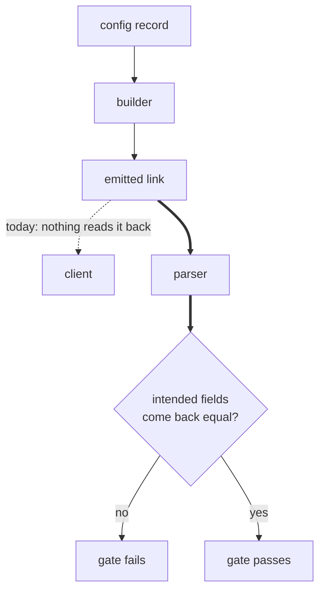
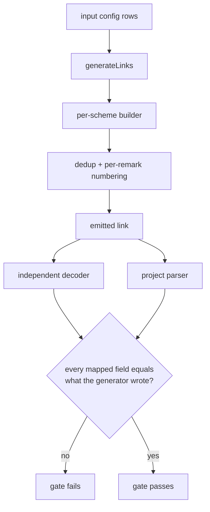
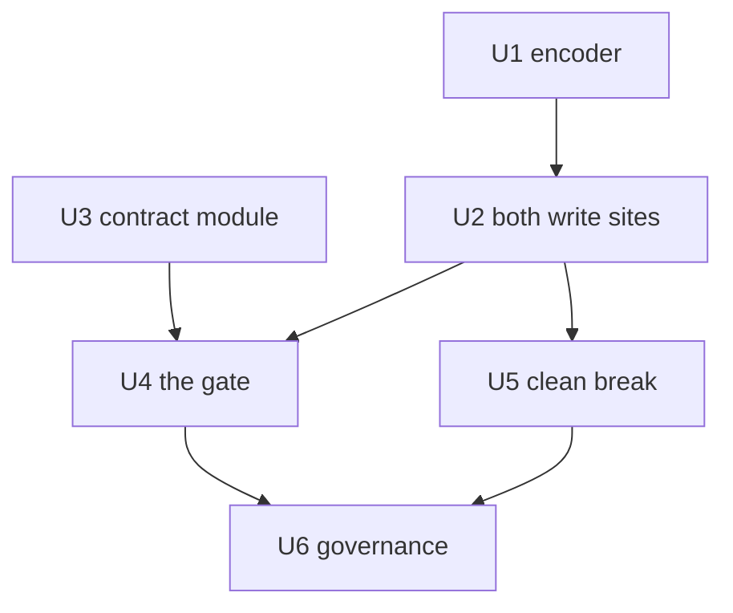

# Vmess Round-Trip Gate - Plan

## Goal Capsule

- **Objective.** Make every emitted `vmess://` link readable by a standard client, and put a round-trip gate over all four schemes so the next encoding or field-preservation break is caught by the test suite.
- **Product authority.** Repository owner. Active scope is this defect and its gate only; the other six directions in `docs/ideation/2026-08-14-open-ideation.html` are not active scope.
- **Open blockers.** None.
- **Execution profile.** Test-first for the pure encoder (U1) and for the gate (U4). The emission fix lands before the gate, and the gate's load-bearing-ness is proved by a temporary local revert rather than a committed red test (KTD7).
- **Stop conditions.** Stop and ask if the manual client check fails after U2, or if an old-shape link turns out to open in any real client — that invalidates the assumption KD3 rests on.
- **Tail ownership.** Standalone `ce-work` owns branch, commits and PR.

---

## Product Contract

### Summary

Correct the `vmess://` payload encoding to the standard shape, and add a round-trip gate that asserts every link the generator emits parses back through the project's own parser with each intended field intact, across `vless`, `vmess`, `trojan` and `ss`. Old-shape links are refused visibly rather than tolerated. Both write sites share one symmetric base64 encoder; the intended-field map lives in its own module so it reads as a specification rather than a test fixture.

### Problem Frame

The generator writes the `vmess` payload as base64 of a percent-encoded JSON string. A client following the ecosystem convention base64-decodes and parses JSON, and gets a string starting with `%7B` instead of an object. Reproduced against head `cd3bc3f`: the standard decode path fails with `Unexpected token '%'`. Nothing in the codebase depends on that path, so the app has no symptom to show.

The project's own parser fails the same way and hides it. `parseVmess` catches the parse error inside its own `try`/`catch` and returns `null` with no message.

The shape has been present since the initial commit, so no `vmess` link this tool ever produced has opened in a client. Nobody reported it because the repository was never advertised and the owner uses `vless`.

The payload is written twice, not once. `buildVmess` encodes it first, and then `withRemark` in `src/utils/dedup.js` re-encodes every surviving link the same non-standard way when it stamps the numbered remark. `generateLinks` routes every generated link through `dedupeAndNumber`, so dedup is the last writer of every `vmess` link the app hands the user. Fixing only `buildVmess` leaves the emitted output unchanged.

Two structural reasons the existing safety net missed it. Nothing in the system ever reads back what the generator writes, so there is no place the mismatch could surface. And the tests that inspect generated `vmess` output decode it with an extra `decodeURIComponent`, which asserts the non-standard shape as the expected one. One module worked around the encoding on the read side: `src/utils/dedup.js` tolerates both shapes so dedup keeps working, with a comment naming the generator as the source of the percent-encoding. The workaround stopped there and never reached the parser.

An old-shape link pasted back in is already refused today: `parseVmess` returns null, the row becomes an unparsed row, and the existing `rows.unparsedError` message renders in all four locales. What is not yet true is the second half of the clean break — dedup still tolerates the old shape on read.

The doubled edge is the loop this plan closes. The dotted edge is the only reader that exists today, and it is outside the repository.

### Key Decisions

- KD1. **The guarantee is field preservation, not string identity.** (session-settled: user-directed — chosen over "parses without error" and "rebuild yields the identical string": identity with the input is impossible because the builder deliberately rewrites address, port, remark and TLS state.) Governs R4.
- KD2. **The gate covers all four schemes, not only the broken one.** (session-settled: user-directed — chosen over vmess-only: the three healthy schemes pass today, so the added cost is near zero and the next leak is caught too.) Governs R3.
- KD3. **Clean break on the old encoding.** (session-settled: user-directed — chosen over keeping a tolerant read path: no old link has ever worked in a client, so there is nothing to preserve, and visible refusal matches ADR 0001's principle that blocking beats silent breakage.) Governs R8.
- KD4. **A fixed table with hand-picked input variety, not a property-based library.** (session-settled: user-approved — chosen over adding `fast-check`: a randomizing library still needs the same intended-field map to assert against, so the library adds input variety only, which five to seven chosen rows supply without opening the ADR 0003 dependency argument.) Governs R6.
- KD5. **The gate asserts that the builder's current intent survives parsing, not that the intent is correct.** (session-settled: user-directed — chosen over letting the gate also judge whether the field set itself is right: that question belongs to the transport-shape direction in `docs/ideation/2026-08-14-open-ideation.html`, and without this line the two efforts block each other.) Governs R5.

<!-- ce-section: work-relationships -->
### How This Work Fits Together

This plan owns the `vmess` emission defect and the round-trip gate over it. The breakdown below is the current understanding of the surrounding directions in `docs/ideation/2026-08-14-open-ideation.html`, not a committed roadmap.

- Transport shape — whether each transport's emitted field set is correct
  - Shares the intended-field map with this plan: this plan pins the map to the builder's current intent, that work decides whether the intent is right.
  - Can proceed independently of this plan.
- Running the test suite in the deploy workflow
  - Enables this gate to bind on every push. Until then the gate holds only where tests are run locally.
- An output-dialect registry emitting Clash and sing-box shapes
  - Depends on this plan: each new emitter inherits the round-trip guarantee instead of needing its own test family.
- A seeded nonce and cross-run diffing
  - Can proceed independently of this plan.
  - The gate's own handling of the unseeded nonce is settled by KTD5, so that work inherits a table it can extend rather than one it must redesign.

### Requirements

**Emission correctness**

- R1. Every `vmess://` link the generator emits is base64 of UTF-8 JSON bytes, readable by a client that base64-decodes and parses JSON with no additional decoding step. This binds both emission sites: `buildVmess` in `src/utils/multiplier.js` and `withRemark` in `src/utils/dedup.js`.
- R2. Non-ASCII content in any emitted field survives that encoding unchanged, including a remark carrying Persian text and astral-plane characters.

**The round-trip gate**

- R3. For each of `vless`, `vmess`, `trojan` and `ss`, a link produced by the generator parses back through the project's own parser without error and without a null result. "The generator" here means the output of `generateLinks` — the post-dedup, post-numbering link the app actually hands the user — not the interim output of the builder.
- R4. Each scheme has a declared map of the fields the generator intends to write, and the gate asserts every field in that map returns the value the generator wrote. For the remark field the expected value is the renumbered label dedup writes, not the builder's interim suffix.
- R5. The intended-field map takes its field names and value semantics from each scheme's client-facing grammar rather than from the current builder's source, so the gate reads as a specification. Membership of the map is the set the builder writes today: a grammar field the builder omits or the parser drops — `serviceName`, `mode`, `seed` — is recorded as a transport-shape question, not a gate failure.
- R5b. Each scheme's round trip is also asserted through a decode path independent of `src/utils/parser.js`, as AE1 does for `vmess`, so a parser that mirrors a builder mistake cannot make the gate pass.
- R6. The gate's input table covers non-ASCII and boundary cases alongside the ASCII happy path: a Persian remark, a remark containing an emoji, an omitted optional parameter, a bare IP address, and a `path` value carrying reserved characters such as `/ws?ed=2048`. A trailing-dot domain is deliberately not a row: `validateRoutingSubdomain` rejects it before generation, and the builder replaces the input address with the CDN IP, so the value never reaches an emitted field.
- R7. No test in the repository asserts a non-standard payload shape as the expected shape.

**Compatibility**

- R8. A `vmess://` link in the old percent-encoded shape is reported as unreadable input rather than accepted, and no read path retains tolerance for that shape. The paste path already satisfies the first clause at head. The remaining work is removing the dual-shape fallback in `vmessConfig` in `src/utils/dedup.js`.

**Governance**

- R9. The defect is recorded in the `SPEC.md` defect log, and the round-trip guarantee is added as a numbered invariant (`V19`, the next free `§V` ID) whose tests carry its ID.
- R10. The clean-break compatibility stance is recorded as an ADR so it is not re-litigated.

### Acceptance Examples

- AE1. Non-ASCII remark survives emission
  - **Covers R1, R2.**
  - **Given:** a config whose remark contains Persian text and an emoji.
  - **When:** the link is generated and its payload is base64-decoded as UTF-8 bytes and parsed as JSON.
  - **Then:** the remark field equals the remark the generator wrote, with no percent-escapes remaining.

- AE2. Every scheme survives its own round trip
  - **Covers R3, R4.**
  - **Given:** one config per supported scheme and one option set.
  - **When:** each generated link is parsed by the project's parser.
  - **Then:** the result is non-null, and every field in that scheme's intended-field map equals what the generator wrote.

- AE3. An old-shape link is refused, not absorbed
  - **Covers R8.**
  - **Given:** a `vmess://` link in the old percent-encoded shape pasted as input.
  - **When:** the input is parsed.
  - **Then:** the tool reports the line as unreadable rather than accepting it or silently dropping it.

### Success Criteria

- One generated `vmess://` link opens in a real client. No unit test can establish this, so it is a one-time manual check and part of calling the work done.
- The gate is green for all four schemes, and no test in the repository builds or decodes a `vmess` payload in the percent-encoded shape as the expected shape. The deliberate refusal fixtures in U3 and U5 are the sole exception, and they are hard-coded base64 literals rather than payloads built by encoding. That covers the two assertions in `src/utils/multiplier.test.js` and, in `src/utils/dedup.test.js`, its link-builder helper, its random-SNI builder, its decode helper, and the assertions that read through them.
- The gate binds where the test suite is run. It does not bind on deploy until the suite runs in the deploy workflow, which is out of scope here.

### Scope Boundaries

- Whether the emitted field set is correct — `host` on gRPC, `insecure` and `allowInsecure` under TLS — stays with the transport-shape question. This plan preserves the current intent; it does not judge it.
- The `vmess` parser's fixed key whitelist, which drops `serviceName`, `mode` and `seed` while the query-based schemes carry every parameter through, is part of that same transport-shape question.
- A runtime self-check that refuses to emit any link the app cannot read back. It changes product behavior and carries a four-locale string cost, so it is a separate decision.
- A property-based testing library.
- Running the test suite in the deploy workflow.
- Seeding the random-SNI nonce. The gate must work without it.

### Dependencies and Assumptions

- The deploy workflow runs install and build only, so this gate protects local runs until that is addressed separately. Nothing in this plan depends on it landing first.
- Assumption: no user holds a working `vmess` link from this tool, because output has been non-standard since the initial commit. This assumption is what makes KD3 cheap; if it turns out false, KD3 is the decision to revisit.
- The random-SNI value is generated at build time and differs per run, so the intended-field map cannot assert a fixed value for it.

### Sources and Research

- `src/utils/multiplier.js` — `buildVmess` payload encoding and the random-SNI generator.
- `src/utils/parser.js` — `parseVmess`, its silent null path, and `decodeBase64`, whose two-step percent-escape read is already the exact inverse of the encoder this plan adds.
- `src/utils/dedup.js` — `withRemark`, the second and final site that writes the `vmess` payload; plus the existing dual-shape read tolerance and the comment naming the generator as its source.
- `src/utils/generation.js` — `generateLinks`, which routes every built link through dedup and numbering, making that output the app's real emission boundary. It is `async` and yields per row, so the gate must await it.
- `src/utils/multiplier.test.js` — the two assertions that encode the non-standard shape.
- `src/utils/dedup.test.js` — a second file encoding the shape: its `vmess` link builder, its random-SNI builder, its decode helper, and the remark assertions that read through them.
- `src/utils/generation.test.js` — already builds `vmess` input with plain `btoa(JSON.stringify(...))`, so the standard shape has in-repo precedent on the input side.
- `SPEC.md` — `§V` invariant table and `§B` defect log, and the `V3:`/`V7:` test-naming convention that carries an invariant ID into test names.
- `docs/adr/0001-cdn-subdomain-field.md` — the blocking-beats-silent-breakage principle behind KD3.
- `docs/adr/0003-cdn-subdomain-field-value-semantics.md` — the dependency-cost precedent weighed in KD4.
- `docs/adr/0005-shadowsocks-xray-native-dialect-only.md` — the verbatim-credential rule the `ss` map entry binds to (KTD6).
- `docs/adr/0006-normalized-link-identity-dedup.md` — nonce-not-identity and numbering-is-last, both of which the gate's expectations depend on.
- XTLS/Xray-core issue #91 — the closest thing to a share-link grammar, and the external reference R5 depends on.
- `docs/ideation/2026-08-14-open-ideation.html` — the ideation run this plan came from.

---

## Planning Contract

**Product Contract preservation.** Product Contract unchanged in scope. KD5 gained its settlement label and a `Governs R5` link; no requirement, acceptance example or boundary text changed. The origin's two "Deferred to Planning" questions and the three planning-time questions carried in its review section are answered by KTD2–KTD8 and removed from the document rather than left standing.

### Key Technical Decisions

- KTD1. **One symmetric base64 codec, beside the existing decoder.** Add `encodeBase64` next to `decodeBase64` in `src/utils/parser.js`; both `vmess` write sites call it. `btoa` accepts latin1 code units only, so dropping `encodeURIComponent` alone throws on the Persian or emoji remark R2 requires — the encoder must map the string to UTF-8 bytes first. `decodeBase64` is already the exact inverse and already lives in the parser, which `src/utils/dedup.js` already imports from; a separate `base64.js` module would move two existing callers for no gain. Serves R1, R2.
- KTD2. **The intended-field map lives in its own module, not inside the gate test.** A new `src/utils/roundtrip.js` exports the per-scheme map and the independent decoders; `src/utils/roundtrip.test.js` holds assertions only. (session-settled: user-approved — chosen over declaring the map inside the test file: R5 asks the map to read as a specification, and a module can be reviewed and cited on its own.) Serves R4, R5.
- KTD3. **The independent decode path is hand-written from the grammar.** `src/utils/roundtrip.js` decodes each scheme with platform primitives and imports nothing from `src/utils/parser.js`. R5b exists so a parser that mirrors a builder mistake cannot make the gate pass; reusing `decodeBase64` or `parseConfig` would reintroduce that shared failure. The decoder normalises to the same value shapes `parseConfig` produces — port as a number, authority host lowercased, fragment percent-decoded — so one map entry compares against both paths instead of needing a second set of expectations. Serves R5b.
- KTD4. **The map asserts absence as well as presence.** Each scheme's entry marks the fields that must not appear under a stated condition — a no-TLS link carries no `sni`, `insecure`, `allowInsecure`, `alpn` or `fp`. (session-settled: user-approved — chosen over R4's literal presence-only reading: a regression that adds a field back is invisible to a presence-only map, and V3 already fixes the no-TLS rule the map would otherwise leave unguarded.) Absence has two readings, because the two decode paths normalise differently: through the independent decoder the key must be literally absent from the payload; through `parseConfig` the `vmess` entry asserts the parser's normalised empty value, because `parseVmess` always materialises `sni`, `alpn` and `fp`. `insecure` and `allowInsecure` are asserted through the independent decoder only — the `vmess` key whitelist never surfaces them at all. Serves R4.
- KTD5. **Random SNI gets one dedicated row, asserted by pattern; every other row pins it off.** (session-settled: user-approved — chosen over pinning it off in every row or asserting by pattern in every row: a fixed-value assertion is the sharper check and stays available everywhere else, while one row still covers the nonce path.) Serves R6.
- KTD6. **The `ss` credential is mapped as an opaque verbatim segment.** The map records the userinfo segment with the semantics ADR-0005 and V18 fix — carried byte-for-byte from the source link, never decoded, never re-encoded — rather than the grammar's `method:password` decomposition. Asserting the decomposition would assert a behavior the generator deliberately does not have. Serves R4, R5.
- KTD7. **The gate lands green; a local revert proves it is load-bearing.** The emission fix lands before the gate, and U4's verification restores the old encoder in `withRemark` — the last writer — temporarily, so the emitted link is old-shape whether or not U5 has landed. Reverting `buildVmess` instead proves nothing while U5 is unlanded: `vmessConfig` still tolerates the old shape and re-emits it standard, so the gate stays green. (session-settled: user-approved — chosen over landing the gate red first: a committed failing suite breaks bisecting and any per-unit commit gate, while the revert check gives the same proof without leaving red history.)
- KTD8. **Refusal stays quiet and non-fatal.** `parseVmess`'s silent `try`/`catch` is unchanged, and `withRemark` guards its decode so an unreadable `vmess` link keeps its label unchanged instead of throwing. (session-settled: user-approved — chosen over making the parser loud and letting dedup throw: R8's user-visible refusal is already delivered by the null return plus the existing unparsed-row message, and a throw inside `dedupeAndNumber` would cost the whole run's output for one bad link.) Serves R8.

### High-Level Technical Design

The gate closes the loop the Problem Frame's diagram leaves open, and closes it at the pipeline boundary rather than the builder boundary — `dedupeAndNumber` is the last writer of every link.

Both decode edges feed one comparison: the project parser satisfies R3, the hand-written decoder satisfies R5b, and neither alone can make the gate pass.

The map's shape, as directional guidance rather than a signature — one entry per grammar field, naming where it lives, how the expectation is derived, and any absence condition:

| grammar field | where it lives (query schemes) | expected value | absent when |
|---|---|---|---|
| connect address | authority host | the CDN entry under test | never |
| connect port | authority port | the port under test | never |
| credential | userinfo | source link's segment, verbatim (`ss`: opaque, KTD6) | never |
| routing subdomain | `host` param | the config's routing subdomain | never |
| server name | `sni` param | the routing subdomain, or the nonce pattern under random SNI | no TLS |
| TLS posture | `security` param | `tls` or `none` | never |
| remark | fragment | the renumbered label `<base>-NNN` | never |

For `vmess` the same entries live in the base64 JSON object under its own key names (`add`, `port`, `id`, `host`, `sni`, `tls`, `ps`), which is why the map is per scheme rather than shared.

### Sequencing

U1 → U2 → U4, with U3 startable immediately and required before U4, U5 branching off U2, and U6 last.

### Risks and Dependencies

- **The clean break costs a dedup collapse case.** With the dual-shape tolerance gone, an old-shape link's identity falls back to its raw bytes, so two old-shape links differing only in remark no longer collapse into one. Accepted under KD3 and recorded in the ADR U6 writes, not mitigated.
- **KD3's cheapness rests on an assumption.** Some clients are lenient about payload decoding. If any user holds a link that works, the clean break becomes a visible regression. The manual client check in the Definition of Done is the earliest place this would surface.
- **The fixed table supplies anticipated variety only.** KD4 accepted this against a property-based library. The mitigation available inside this plan is row coverage, not randomness — R6's rows plus KTD4's absence assertions.
- **The gate binds only where the suite runs.** The deploy workflow runs install and build only, so nothing enforces the guarantee on push until that changes. Out of scope here; named so it is not mistaken for coverage this plan delivers.
- **`withRemark`'s guard is defensive, not reachable in the pipeline.** Every link reaching `dedupeAndNumber` in `generateLinks` was built by the generator. The guard exists because `dedupeAndNumber` is exported and tested directly.
- **The grammar reference was not re-read while writing this plan.** R5 and KTD6 point the map's field names at XTLS/Xray-core issue #91, carried from the origin document rather than fetched again here. U3 is where that source is read; if it names a field differently from what the map assumes, U3's entry follows the source and the plan's table is the stale copy.
- **The gate is new surface with no in-repo precedent.** Nothing in the repository feeds generator output back into the parser today, so U4 has no existing test family to mirror. The nearest patterns — driving `generateLinks` in `src/utils/generation.test.js` and the invariant-ID naming convention — cover mechanics, not shape.

---

## Implementation Units

### U1. Symmetric base64 encoder

- **Goal:** an `encodeBase64` that is the exact inverse of `decodeBase64` for any JavaScript string, including astral-plane characters.
- **Requirements:** R1, R2 (KTD1).
- **Dependencies:** none.
- **Files:** `src/utils/parser.js`, `src/utils/parser.test.js`.
- **Approach:** map the string to UTF-8 bytes, then to a binary string, then `btoa`. Export it beside `decodeBase64` with a comment naming why `btoa` alone is wrong. No caller changes in this unit.
- **Execution note:** implement test-first — the astral-plane case is the one the naive fix throws on, so it must fail for the right reason before the fix.
- **Patterns to follow:** the two-step shape of `decodeBase64` in `src/utils/parser.js`; the existing test style in `src/utils/parser.test.js`.
- **Test scenarios:**
  - An ASCII JSON string encodes to the same output a plain `btoa` produces.
  - Persian text round-trips through `encodeBase64` then `decodeBase64` unchanged.
  - An emoji (astral plane, surrogate pair) round-trips unchanged.
  - A string mixing ASCII, Persian and emoji round-trips unchanged.
  - Encoding Persian text does not throw — this is the `btoa` latin1 limit the naive fix hits.
  - The empty string round-trips to the empty string.
- **Verification:** `npm test` green, with the new cases passing and no existing parser test changed.

### U2. Standard-shape vmess emission at both write sites

- **Goal:** both sites that write a `vmess` payload emit base64 of UTF-8 JSON bytes, and no test asserts the old shape.
- **Requirements:** R1, R2, R7; AE1 (KTD1).
- **Dependencies:** U1.
- **Files:** `src/utils/multiplier.js`, `src/utils/dedup.js`, `src/utils/multiplier.test.js`, `src/utils/dedup.test.js`.
- **Approach:**
  1. `buildVmess` replaces its `btoa(encodeURIComponent(...))` with the U1 encoder.
  2. `withRemark` does the same, and its comment stops describing the encoding as the multiplier's non-standard one.
  3. In `src/utils/multiplier.test.js`, both decoding assertions drop the extra `decodeURIComponent`.
  4. In `src/utils/dedup.test.js`, the `vmess` link builder, the random-SNI builder and the decode helper move to the standard shape.
- **Execution note:** run the suite after the two source changes alone. The failures that appear are exactly the assertions R7 removes — read them before rewriting them.
- **Patterns to follow:** `src/utils/generation.test.js` already builds `vmess` input with plain `btoa(JSON.stringify(...))`.
- **Test scenarios:**
  - Covers AE1. A config whose remark carries Persian text and an emoji generates a link whose payload base64-decodes as UTF-8 and parses as JSON, with the remark equal and no percent-escapes left.
  - A generated `vmess` payload decodes with a single base64 step and needs no second decode.
  - The existing sni-under-TLS-only assertion still holds when read through the standard decode.
  - The existing host, sni and connect-address assertions still hold when read through the standard decode.
  - Dedup identity still collapses two `vmess` links differing only in `ps` when both are built in the standard shape.
  - Numbering still writes `<base>-NNN` into `ps`, and the link still decodes afterwards.
- **Verification:** `npm test` green, and the Verification Contract's old-shape scan passes.

### U3. Round-trip contract module

- **Goal:** a per-scheme map of the fields the generator intends to write, plus decoders that do not depend on the parser.
- **Requirements:** R4, R5, R5b (KTD2, KTD3, KTD4, KTD6).
- **Dependencies:** none — the module encodes nothing, and its test scenarios all use hand-built links, so it can start alongside U1.
- **Files:** `src/utils/roundtrip.js`, `src/utils/roundtrip.test.js`.
- **Approach:** take field names and value semantics from each scheme's client-facing grammar (XTLS/Xray-core issue #91), and from ADR-0005 for the `ss` credential. Each entry names the field, where it lives in the link, how the expected value derives from the generation input, and any condition under which it must be absent. Decoders are written from the grammar with platform primitives only, and the module imports nothing from `src/utils/parser.js`. Grammar fields the builder does not write — `serviceName`, `mode`, `seed` — are recorded as transport-shape notes in the module's comments, not as map entries.
- **Patterns to follow:** the explanatory module-header comment style of `src/utils/dedup.js` and `src/utils/parser.js`, which is where this repo states its rules.
- **Test scenarios:**
  - The `vmess` decoder returns, for a hand-built standard-shape link, the same object a plain base64-then-JSON read gives.
  - The `vmess` decoder fails on an old percent-encoded payload rather than silently succeeding.
  - The query-scheme decoder returns address, port, credential and every query parameter for a hand-written `vless` link.
  - The `ss` decoder returns the credential segment byte-for-byte, including a colon inside it.
  - Each scheme's decoder returns the fragment remark percent-decoded.
  - Every map entry states either an expected value or an absence condition, for all four schemes.
- **Verification:** `npm test` green; the module has no import from `src/utils/parser.js`.

### U4. The round-trip gate

- **Goal:** for each scheme, a link from `generateLinks` parses back through both decode paths with every mapped field intact.
- **Requirements:** R3, R4, R5b, R6; AE2 (KTD5, KTD7).
- **Dependencies:** U2, U3.
- **Files:** `src/utils/roundtrip.test.js`.
- **Approach:** drive `generateLinks` with one config per scheme and the input table's option sets, then assert the post-dedup, post-numbering link through `parseConfig` and through the U3 decoder. `generateLinks` is `async`, so each row awaits it. The remark expectation is the renumbered label, not the builder's interim suffix. Input table rows: ASCII happy path; Persian remark; emoji remark; omitted optional parameter; bare IP address; a `path` carrying `/ws?ed=2048`; one random-SNI row. Every row except the random-SNI one pins `randomSni` off.
- **Execution note:** once the gate is green, restore the old encoder in `withRemark` in `src/utils/dedup.js` locally — the last writer, so the emitted link is old-shape regardless of whether U5 has landed — confirm the gate's `vmess` rows fail, then restore the fix. Expect the remark assertions in `src/utils/dedup.test.js` that decode dedup output to fail alongside them; nothing else should. Record the observation in the commit message; do not commit the revert.
- **Patterns to follow:** `src/utils/generation.test.js` for driving `generateLinks` and awaiting it; the `V3:`/`V7:` test-naming convention — name the gate's tests `V19:`, the next free `§V` ID, which U6 writes into `SPEC.md`.
- **Test scenarios:**
  - Covers AE2. For each of `vless`, `vmess`, `trojan` and `ss`, the generated link parses non-null and every mapped field equals what the generator wrote.
  - Each scheme's link passes the same field comparison through the independent decoder.
  - A Persian remark survives to the parsed remark for each scheme.
  - An emoji remark survives to the parsed remark for each scheme.
  - A `path` of `/ws?ed=2048` comes back with its reserved characters intact and does not split the query.
  - A config with a bare IP address as its connect address round-trips, and the routing subdomain still resolves from `host`.
  - A config that omits an optional parameter round-trips per scheme: absent from the query string for `vless`, `trojan` and `ss`; present as an empty string for `vmess`, because `buildVmess` writes a fixed key set. The `vmess` behaviour is the current intent KD5 pins, not a defect.
  - A no-TLS link carries no `sni`, `insecure`, `allowInsecure`, `alpn` or `fp` — literally absent through the independent decoder, and through `parseConfig` the `vmess` row asserts the normalised empty value per KTD4.
  - Under random SNI, `sni` matches the nonce pattern, its root domain equals the routing subdomain's root, and the trailing dot `genRandomSni` writes is part of the pattern.
  - The asserted remark is the renumbered label, and two configs sharing a base remark come back with distinct labels.
- **Verification:** the gate is green for all four schemes, and the temporary-revert check reddens the gate's `vmess` rows with no non-`vmess` test failing beyond the dedup remark assertions named in the Execution note.

### U5. Clean break on the old encoding

- **Goal:** no read path tolerates the percent-encoded payload.
- **Requirements:** R8; AE3 (KTD8).
- **Dependencies:** U2.
- **Files:** `src/utils/dedup.js`, `src/utils/dedup.test.js`, `src/utils/parser.test.js`.
- **Approach:** `vmessConfig` drops its `decodeURIComponent` fallback, and its comment loses the dual-shape rationale. `withRemark` guards the decode and returns the link unchanged when it fails. `parseVmess` is not touched.
- **Patterns to follow:** `vmessIdentity`'s existing "a link that does not decode states no identity" guard, which is the same posture applied to the write side.
- **Test scenarios:**
  - Covers AE3. An old-shape `vmess://` link parses to null, so its row is an unparsed row.
  - Dedup identity for an old-shape link falls back to the link's own bytes, so it matches only a byte-identical twin.
  - Two old-shape links differing only in `ps` no longer collapse — the accepted loss, asserted so it is deliberate.
  - Numbering leaves an undecodable `vmess` link unchanged instead of throwing.
  - A standard-shape link still decodes, dedups and numbers as before.
- **Verification:** `npm test` green; no `decodeURIComponent` remains in `src/utils/dedup.js`.

### U6. Governance record

- **Goal:** the defect and the guarantee are written where this project keeps them.
- **Requirements:** R9, R10.
- **Dependencies:** U4, U5.
- **Files:** `SPEC.md`, `docs/adr/0007-vmess-payload-clean-break.md`, `src/utils/roundtrip.test.js`.
- **Approach:** add a `§B` row naming both write sites, the tests that asserted the shape, and the missing read-back; add `V19` — the next free ID, since `§V` ends at `V18` — as the round-trip invariant. U4 already names the gate's tests `V19:`, the way `V3:` and `V7:` are named, so this unit only reconciles those names if the ID shifted. The ADR records the clean-break stance, the assumption it rests on, and the dedup collapse case it costs.
- **Patterns to follow:** `docs/adr/0006-normalized-link-identity-dedup.md` for ADR shape, including its Considered Options section.
- **Test scenarios:** `Test expectation: none new — the gate tests U4 wrote already carry the invariant ID and must stay green.`
- **Verification:** `V19` appears in `SPEC.md` and in the gate's test names, `npm test` is still green, and the ADR follows the numbering and shape of ADR 0006.

---

## Verification Contract

| gate | command or check | applies to |
|---|---|---|
| unit suite | `npm test` | U1, U2, U3, U4, U5, U6 |
| watch loop during work | `npm run test:watch` | all units |
| production build still passes | `npm run build` | U1, U2, U3, U5 |
| old-shape scan | `btoa(encodeURIComponent` returns nothing anywhere under `src/`; `decodeURIComponent(atob` returns nothing under `src/` outside `decodeBase64` in `src/utils/parser.js`, which is the standard-shape reader and stays | U2, U5 |
| parser-independence scan | `src/utils/roundtrip.js` has no import from `src/utils/parser.js` | U3 |
| gate is load-bearing | temporarily restore the old encoder in `withRemark` — the last writer; the gate's `vmess` rows fail alongside the dedup remark assertions, and no other test fails | U4 |
| real-client check | paste one generated `vmess://` link into a standard client and connect | Definition of Done |

---

## Definition of Done

**Global**

- `npm test` is green and `npm run build` succeeds.
- One generated `vmess://` link opens in a real client. This is manual, done once after U2, and is the only check that proves the defect is actually fixed.
- No file under `src/` builds or reads a `vmess` payload in the percent-encoded shape as an expected shape. The deliberate refusal fixtures in U3 and U5 are the sole exception, and they are hard-coded base64 literals.
- `SPEC.md` carries the defect row and invariant `V19`; `docs/adr/0007-vmess-payload-clean-break.md` exists.
- No abandoned experimental code remains in the diff — in particular, the temporary encoder revert from U4 is not committed.

**Per unit**

| unit | done signal |
|---|---|
| U1 | `encodeBase64` exists beside `decodeBase64` and round-trips Persian and astral-plane text |
| U2 | both write sites use it, and no test in `src/` asserts the old shape |
| U3 | the per-scheme map and its decoders exist, with no parser import |
| U4 | the gate is green for all four schemes and reddens under the temporary revert |
| U5 | the dual-shape fallback is gone and an old-shape link is refused |
| U6 | the defect row, invariant `V19` and ADR 0007 are written, and the gate's test names carry `V19` |
