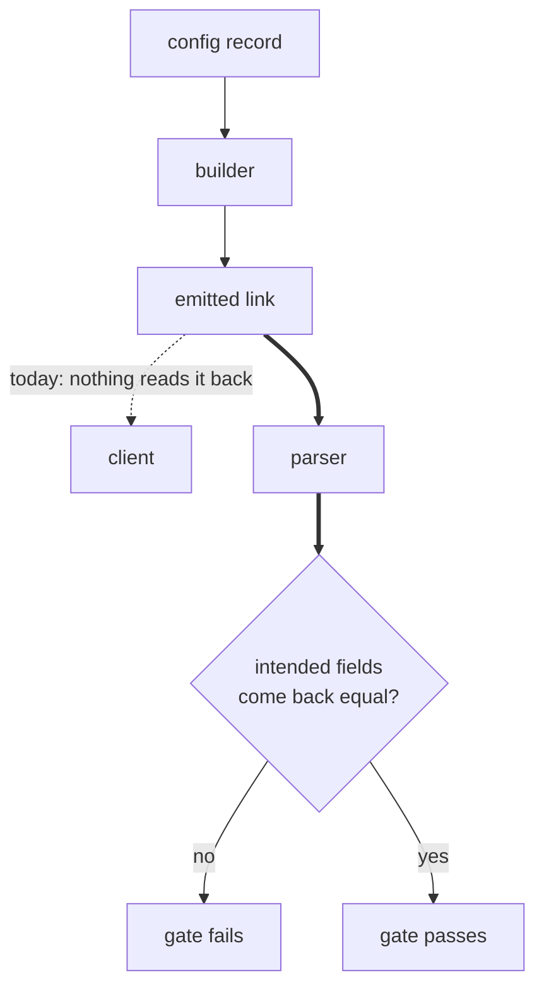

# Vmess Round-Trip Gate - Plan

## Goal Capsule

- **Objective.** Make every emitted `vmess://` link readable by a standard client, and put a round-trip gate over all four schemes so the next encoding or field-preservation break is caught before release.
- **Product authority.** Repository owner. Active scope is this defect and its gate only; the other six directions in `docs/ideation/2026-08-14-open-ideation.html` are not active scope.
- **Open blockers.** None.

---

## Product Contract

### Summary

Correct the `vmess://` payload encoding to the standard shape, and add a round-trip gate that asserts every link the generator emits parses back through the project's own parser with each intended field intact, across `vless`, `vmess`, `trojan` and `ss`. Old-shape links are refused visibly rather than tolerated.

### Problem Frame

The generator writes the `vmess` payload as base64 of a percent-encoded JSON string. A client following the ecosystem convention base64-decodes and parses JSON, and gets a string starting with `%7B` instead of an object. Reproduced against head `cd3bc3f`: the standard decode path fails with `Unexpected token '%'`. Nothing in the codebase depends on that path, so the app has no symptom to show.

The project's own parser fails the same way and hides it. `parseVmess` catches the parse error inside its own `try`/`catch` and returns `null` with no message.

The shape has been present since the initial commit, so no `vmess` link this tool ever produced has opened in a client. Nobody reported it because the repository was never advertised and the owner uses `vless`.

Two structural reasons the existing safety net missed it. Nothing in the system ever reads back what the generator writes, so there is no place the mismatch could surface. And the two tests that inspect generated `vmess` output decode it with an extra `decodeURIComponent`, which asserts the non-standard shape as the expected one. One module worked around the encoding in isolation: `src/utils/dedup.js` tolerates both shapes so dedup keeps working, with a comment naming the generator as the source of the percent-encoding. The workaround stopped there and never reached the parser.

The doubled edge is the loop this plan closes. The dotted edge is the only reader that exists today, and it is outside the repository.

### Key Decisions

- KD1. **The guarantee is field preservation, not string identity.** (session-settled: user-directed — chosen over "parses without error" and "rebuild yields the identical string": identity with the input is impossible because the builder deliberately rewrites address, port, remark and TLS state.) Governs R4.
- KD2. **The gate covers all four schemes, not only the broken one.** (session-settled: user-directed — chosen over vmess-only: the three healthy schemes pass today, so the added cost is near zero and the next leak is caught too.) Governs R3.
- KD3. **Clean break on the old encoding.** (session-settled: user-directed — chosen over keeping a tolerant read path: no old link has ever worked in a client, so there is nothing to preserve, and visible refusal matches ADR 0001's principle that blocking beats silent breakage.) Governs R8.
- KD4. **A fixed table with hand-picked input variety, not a property-based library.** (session-settled: user-approved — chosen over adding `fast-check`: a randomizing library still needs the same intended-field map to assert against, so the library adds input variety only, which five to seven chosen rows supply without opening the ADR 0003 dependency argument.) Governs R6.
- KD5. **The gate asserts that the builder's current intent survives parsing, not that the intent is correct.** Whether the field set itself is right belongs to the transport-shape question in `docs/ideation/2026-08-14-open-ideation.html`; without this line the two efforts block each other.

<!-- ce-section: work-relationships -->
### How This Work Fits Together

This plan owns the `vmess` emission defect and the round-trip gate over it. The breakdown below is the current understanding of the surrounding directions in `docs/ideation/2026-08-14-open-ideation.html`, not a committed roadmap.

- Transport shape — whether each transport's emitted field set is correct
  - Shares the intended-field map with this plan: this plan pins the map to the builder's current intent, that work decides whether the intent is right.
  - Can proceed independently of this plan.
- Running the test suite in the deploy workflow
  - Enables this gate to bind on every push. Until then the gate holds only where tests are run locally.
- An output-dialect registry emitting Clash and sing-box shapes
  - Depends on this plan: each new emitter inherits the round-trip guarantee instead of needing its own test family.
- A seeded nonce and cross-run diffing
  - Can proceed independently of this plan.
  - Still to decide: whether the gate's input table pins random SNI off or asserts it by pattern.

### Requirements

**Emission correctness**

- R1. Every `vmess://` link the generator emits is base64 of UTF-8 JSON bytes, readable by a client that base64-decodes and parses JSON with no additional decoding step.
- R2. Non-ASCII content in any emitted field survives that encoding unchanged, including a remark carrying Persian text and astral-plane characters.

**The round-trip gate**

- R3. For each of `vless`, `vmess`, `trojan` and `ss`, a link produced by the generator parses back through the project's own parser without error and without a null result.
- R4. Each scheme has a declared map of the fields the generator intends to write, and the gate asserts every field in that map returns the value the generator wrote.
- R5. The intended-field map is derived from each scheme's client-facing grammar rather than read off the current builder, so the gate cannot ratify whatever the builder happens to do.
- R6. The gate's input table covers non-ASCII and boundary cases alongside the ASCII happy path: a Persian remark, a remark containing an emoji, an omitted optional parameter, a bare IP address, and a domain with a trailing dot.
- R7. No test in the repository asserts a non-standard payload shape as the expected shape.

**Compatibility**

- R8. A `vmess://` link in the old percent-encoded shape is reported as unreadable input rather than accepted, and no read path retains tolerance for that shape.

**Governance**

- R9. The defect is recorded in the `SPEC.md` defect log, and the round-trip guarantee is added as a numbered invariant whose tests carry its ID.
- R10. The clean-break compatibility stance is recorded as an ADR so it is not re-litigated.

### Acceptance Examples

- AE1. Non-ASCII remark survives emission
  - **Covers R1, R2.**
  - **Given:** a config whose remark contains Persian text and an emoji.
  - **When:** the link is generated and its payload is base64-decoded as UTF-8 bytes and parsed as JSON.
  - **Then:** the remark field equals the remark the generator wrote, with no percent-escapes remaining.

- AE2. Every scheme survives its own round trip
  - **Covers R3, R4.**
  - **Given:** one config per supported scheme and one option set.
  - **When:** each generated link is parsed by the project's parser.
  - **Then:** the result is non-null, and every field in that scheme's intended-field map equals what the generator wrote.

- AE3. An old-shape link is refused, not absorbed
  - **Covers R8.**
  - **Given:** a `vmess://` link in the old percent-encoded shape pasted as input.
  - **When:** the input is parsed.
  - **Then:** the tool reports the line as unreadable rather than accepting it or silently dropping it.

### Success Criteria

- One generated `vmess://` link opens in a real client. No unit test can establish this, so it is a one-time manual check and part of calling the work done.
- The gate is green for all four schemes, and the two assertions that currently encode the non-standard shape no longer exist in any form.

### Scope Boundaries

- Whether the emitted field set is correct — `host` on gRPC, `insecure` and `allowInsecure` under TLS — stays with the transport-shape question. This plan preserves the current intent; it does not judge it.
- The `vmess` parser's fixed key whitelist, which drops `serviceName`, `mode` and `seed` while the query-based schemes carry every parameter through, is part of that same transport-shape question.
- A runtime self-check that refuses to emit any link the app cannot read back. It changes product behavior and carries a four-locale string cost, so it is a separate decision.
- A property-based testing library.
- Running the test suite in the deploy workflow.
- Seeding the random-SNI nonce. The gate must work without it.

### Dependencies and Assumptions

- The deploy workflow runs install and build only, so this gate protects local runs until that is addressed separately. Nothing in this plan depends on it landing first.
- Assumption: no user holds a working `vmess` link from this tool, because output has been non-standard since the initial commit. This assumption is what makes KD3 cheap; if it turns out false, KD3 is the decision to revisit.
- The random-SNI value is generated at build time and differs per run, so the intended-field map cannot assert a fixed value for it.

### Outstanding Questions

**Deferred to Planning**

- The concrete shape of the intended-field map per scheme, and where it lives so it reads as a specification rather than a test fixture.
- Whether the input table pins random SNI off, asserts it by pattern, or does both in separate rows.

### Sources and Research

- `src/utils/multiplier.js` — `buildVmess` payload encoding and the random-SNI generator.
- `src/utils/parser.js` — `parseVmess`, its silent null path, and `decodeBase64`.
- `src/utils/dedup.js` — the existing dual-shape tolerance and the comment naming the generator as the source.
- `src/utils/multiplier.test.js` — the two assertions that encode the non-standard shape.
- `docs/adr/0001-cdn-subdomain-field.md` — the blocking-beats-silent-breakage principle behind KD3.
- `docs/adr/0003-cdn-subdomain-field-value-semantics.md` — the dependency-cost precedent weighed in KD4.
- XTLS/Xray-core issue #91 — the closest thing to a share-link grammar, and the external reference R5 depends on.
- `docs/ideation/2026-08-14-open-ideation.html` — the ideation run this plan came from.
